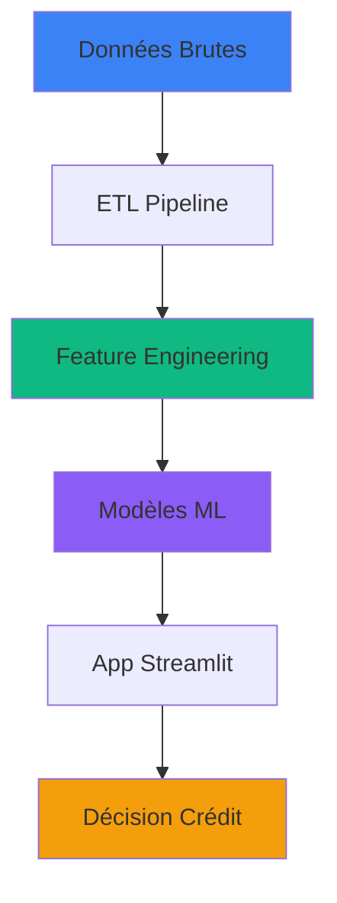

<!-- Auteur : Lesueur Romain -->


<div align="center">

<!-- En-tête avec gradient -->


### **Projet de Machine Learning : Automatisation de l'octroi de crédit**

<p align="center">
  
  
  
  
</p>

<br>

<!-- Badges des technologies -->
<p align="center">
  
  
  
  
</p>

</div>

<br>

---

## Description du projet

<div align="center">
<table>
<tr>
<td width="70%">

Application de scoring crédit permettant de calculer la probabilité qu'un client puisse rembourser ou non son prêt. Ce système aide une banque à automatiser la décision d'octroi de crédit pour des clients ayant peu ou pas d'historique de prêt.

### Objectifs principaux

<div align="left">

- **Prédire** le risque de défaut de paiement pour les demandes de crédit
- **Automatiser** la décision d'octroi de crédit avec un modèle ML robuste
- **Traiter** le déséquilibre des classes (~92% classe 0, ~8% classe 1)
- **Déployer** une application web intuitive pour les agents bancaires

</div>

</td>
<td width="30%">



</td>
</tr>
</table>
</div>

### Variable Cible

<div align="center">

| Classe | Signification | Distribution |
|--------|---------------|--------------|
| **0** | Le client sait rembourser | ~92% |
| **1** | Le client ne sait pas rembourser | ~8% |

</div>

---

## Équipe du projet

<div align="center">

<table>
<tr>
<td align="center" width="50%">
<a href="https://github.com/">

</a>
<br><br>
<h3>Matthias Defretin</h3>
<p>


</p>
<sub>ETL Pipeline & Feature Engineering</sub>
<br>
<sub>Preprocessing & Modeling</sub>
</td>

<td align="center" width="50%">
<a href="https://github.com/EkiaND/">

</a>
<br><br>
<h3>Romain Lesueur</h3>
<p>


</p>
<sub>Model Optimization & Evaluation</sub>
<br>
<sub>Streamlit Application Development</sub>
</td>
</tr>
</table>

</div>

---

## Architecture du projet

<div align="center">

Le projet est organisé en **3 branches principales** correspondant aux différentes phases du développement :

<br>

<table>
<thead>
<tr>
<th width="5%">#</th>
<th width="25%">Branch / Phase</th>
<th width="25%">Responsable(s)</th>
<th width="45%">Tâches réalisées</th>
</tr>
</thead>
<tbody>

<!-- PHASE 1 : ETL -->
<tr>
<td colspan="4" align="center" style="background-color:#3B82F6; color:white;"><b>BRANCH 1 : ETL (Extract, Transform, Load)</b></td>
</tr>

<tr>
<td align="center"><b>1</b></td>
<td><b>Data Preparation</b></td>
<td>Matthias Defretin</td>
<td>
• Fusion (merge) de l'ensemble des fichiers de données<br>
• Gestion des valeurs manquantes et duplicatas<br>
• Traitement des valeurs aberrantes<br>
• Détection et traitement des multi-colinéarités<br>
• Feature engineering : création de nouvelles variables pertinentes<br>
• Préparation de la dataset finale propre
</td>
</tr>

<!-- PHASE 2 : MODELING -->
<tr>
<td colspan="4" align="center" style="background-color:#10B981; color:white;"><b>BRANCH 2 : Modeling (Entraînement & Optimisation)</b></td>
</tr>

<tr>
<td align="center"><b>2</b></td>
<td><b>Exploratory Data Analysis</b></td>
<td>Matthias Defretin<br>Romain Lesueur</td>
<td>
• Analyse univariée de toutes les variables pertinentes<br>
• Analyse bivariée et corrélations<br>
• Visualisations des distributions
</td>
</tr>

<tr>
<td align="center"><b>3</b></td>
<td><b>Model Training</b></td>
<td>Matthias Defretin<br>Romain Lesueur</td>
<td>
• Implémentation de 3 modèles de classification :<br>
&nbsp;&nbsp;- Random Forest<br>
&nbsp;&nbsp;- XGBoost<br>
&nbsp;&nbsp;- Régression Logistique<br>
• Évaluation des performances avec métriques appropriées<br>
• Gestion du déséquilibre des classes avec SMOTE<br>
• Ré-entraînement des modèles optimisés<br>
• Sélection du meilleur modèle<br>
• Sauvegarde du modèle final (.pickle/.joblib)
</td>
</tr>

<!-- PHASE 3 : APPLICATION -->
<tr>
<td colspan="4" align="center" style="background-color:#8B5CF6; color:white;"><b>BRANCH 3 : Application (Streamlit Web App)</b></td>
</tr>

<tr>
<td align="center"><b>4</b></td>
<td><b>Web Application</b></td>
<td>Romain Lesueur</td>
<td>
• Développement d'une application web avec Streamlit<br>
• Interface de saisie des informations client<br>
• Intégration du modèle pré-entraîné<br>
• Système de prédiction en temps réel<br>
• Affichage de la décision : "Crédit Accordé" / "Crédit Refusé"<br>
• Design et UX intuitifs
</td>
</tr>

</tbody>
</table>

</div>

---

## Métriques d'évaluation

<div align="center">

<table>
<tr>
<td align="center" width="33%">
<h3>Précision</h3>
<br>

</td>
<td align="center" width="33%">
<h3>Rappel & F1</h3>
<br>

</td>
<td align="center" width="33%">
<h3>Performance</h3>
<br>

</td>
</tr>
</table>

</div>

---

## Stack Technologique

<div align="center">

<table>
<tr>
<td align="center" width="25%">
<h3>Machine Learning</h3>


</td>
<td align="center" width="25%">
<h3>Data Science</h3>


</td>
<td align="center" width="25%">
<h3>Application</h3>


</td>
<td align="center" width="25%">
<h3>Serialization</h3>


</td>
</tr>
</table>

</div>

---

## Installation et utilisation

### Prérequis

```bash
Python 3.8+
pip
virtualenv (recommandé)
```

### Installation

```bash
# 1. Cloner le repository
git clone https://github.com/EkiaND/SCS.git
cd SCS

# 2. Créer un environnement virtuel (recommandé)
python -m venv venv
source venv/bin/activate  # Linux/Mac
# ou
venv\Scripts\activate     # Windows

# 3. Installer les dépendances
pip install -r requirement.txt

# 4. Lancer l'application Streamlit
streamlit run app/app.py
```

L'application sera accessible sur **http://localhost:8501**

---

## Livrables du projet

<div align="center">

<table>
<thead>
<tr>
<th width="30%">Livrable</th>
<th width="25%">Format</th>
<th width="20%">Responsable(s)</th>
<th width="25%">Statut</th>
</tr>
</thead>
<tbody>
<tr>
<td><b>Dataset nettoyée et prétraitée</b></td>
<td>CSV + Notebooks</td>
<td>Matthias</td>
<td></td>
</tr>
<tr>
<td><b>Notebooks d'analyse et modélisation</b></td>
<td>.ipynb</td>
<td>Matthias + Romain</td>
<td></td>
</tr>
<tr>
<td><b>3 modèles de classification</b></td>
<td>.pickle/.joblib</td>
<td>Matthias + Romain</td>
<td></td>
</tr>
<tr>
<td><b>Modèle final optimisé</b></td>
<td>.pickle/.joblib</td>
<td>Matthias + Romain</td>
<td></td>
</tr>
<tr>
<td><b>Application web Streamlit</b></td>
<td>Python + .py</td>
<td>Romain</td>
<td></td>
</tr>
<tr>
<td><b>Rapport de projet</b></td>
<td>PDF</td>
<td>Matthias + Romain</td>
<td></td>
</tr>
<tr>
<td><b>Présentation PowerPoint</b></td>
<td>PDF/PPTX</td>
<td>Matthias + Romain</td>
<td></td>
</tr>
</tbody>
</table>

<br>

> **DATE LIMITE**
> - **Rendu final** : Lundi 05 janvier 2026 à minuit
> - **Soutenances** : À communiquer ultérieurement

</div>

---

## Modèles implémentés

<div align="center">

<table>
<tr>
<td align="center" width="33%">
<h3>Random Forest</h3>
<p>Ensemble de arbres de décision</p>

<br><br>
<sub>Robuste au surapprentissage</sub><br>
<sub>Gestion naturelle des données non linéaires</sub>
</td>
<td align="center" width="33%">
<h3>XGBoost</h3>
<p>Gradient Boosting optimisé</p>

<br><br>
<sub>Haute performance</sub><br>
<sub>Régularisation intégrée</sub>
</td>
<td align="center" width="33%">
<h3>Régression Logistique</h3>
<p>Modèle linéaire probabiliste</p>

<br><br>
<sub>Interprétable</sub><br>
<sub>Baseline solide</sub>
</td>
</tr>
</table>

</div>

---

## Gestion du déséquilibre des classes

<div align="center">

### Problématique
Distribution initiale : **~92% classe 0** vs **~8% classe 1**

### Solution adoptée : SMOTE
**S**ynthetic **M**inority **O**ver-sampling **TE**chnique

<table>
<tr>
<td width="50%">
<h4>Avant SMOTE</h4>
<ul>
<li>Classe majoritaire (0) : ~92%</li>
<li>Classe minoritaire (1) : ~8%</li>
<li>Risque de biais vers la classe 0</li>
<li>Faible rappel pour la classe 1</li>
</ul>
</td>
<td width="50%">
<h4>Après SMOTE</h4>
<ul>
<li>Distribution équilibrée</li>
<li>Création de données synthétiques</li>
<li>Amélioration du Recall classe 1</li>
<li>Meilleure généralisation</li>
</ul>
</td>
</tr>
</table>

</div>

---

## Contact

<div align="center">

Pour toute question concernant ce projet :

<table>
<tr>
<td align="center" width="50%">
<h3>Matthias Defretin</h3>
<p>


</p>
</td>
<td align="center" width="50%">
<h3>Romain Lesueur</h3>
<p>


</p>
</td>
</tr>
</table>

</div>

---

<div align="center">

### Informations du projet

**Projet de Machine Learning**
*Automatisation de l'octroi de crédit bancaire*

<br>

<p>
<a href="https://github.com/EkiaND/SCS">

</a>
<a href="https://github.com/EkiaND/SCS">

</a>
<a href="https://github.com/EkiaND/SCS">

</a>
</p>

<br>

---

<!-- Footer avec vague -->


<div align="center">
<sub>© 2025-2026 - Projet académique - Tous droits réservés</sub>
<br>
<sub>Matthias Defretin • Romain Lesueur</sub>
</div>

</div>

